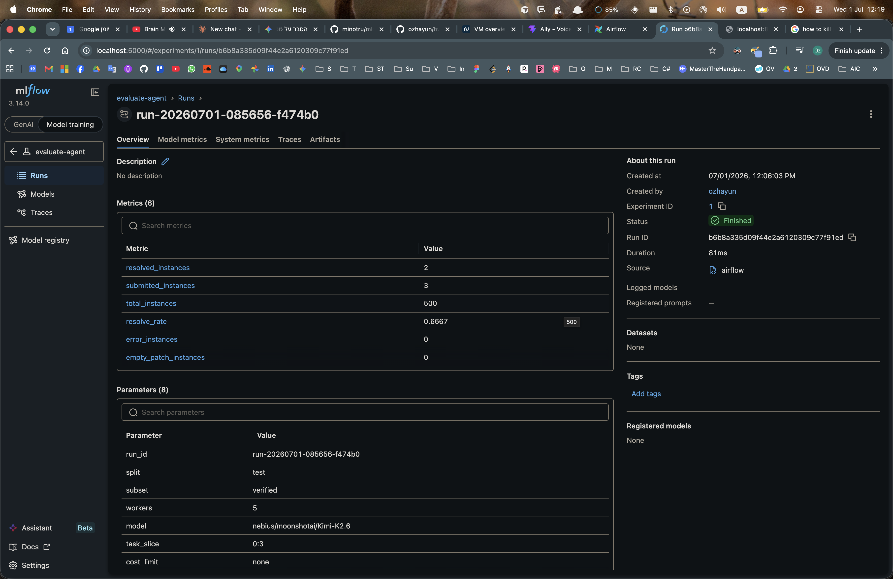

# REPORT: End-to-End ML Pipeline Assignment

## Screenshots

**Airflow DAG — completed run:**


**MLflow — logged run with metrics:**


## Architecture

The pipeline converts ad-hoc coding-agent evaluation scripts into a configurable,
reproducible Airflow DAG with MLflow tracking.

```
┌─────────────────────────────────────────────────────────────┐
│                    Airflow DAG: evaluate_agent               │
│                                                             │
│  prepare_run ──► run_agent ──► run_eval ──► summarize_and_log │
│      │               │             │              │          │
│  config.json    preds.json    report.json    metrics.json   │
│                trajectories/    eval logs    MLflow log      │
└─────────────────────────────────────────────────────────────┘
```

### Task breakdown

| Task | What it does |
|------|-------------|
| `prepare_run` | Reads Airflow params, generates a `run_id`, writes `runs/<run-id>/config.json` |
| `run_agent` | Calls `mini-extra swebench` to run the agent batch; writes trajectories and `preds.json` to `runs/<run-id>/run-agent/` |
| `run_eval` | Calls `swebench.harness.run_evaluation` on the predictions; writes JSON report and logs to `runs/<run-id>/run-eval/` |
| `summarize_and_log` | Parses the eval report, writes `metrics.json` + `manifest.json`, logs params/metrics/artifact path to MLflow |

### Data flow between tasks

Tasks pass a `run_info` dict via XCom:
```json
{
  "run_config": { ... },
  "run_dir": "/path/to/runs/<run-id>",
  "preds_path": "/path/to/runs/<run-id>/run-agent/preds.json",
  "eval_dir": "/path/to/runs/<run-id>/run-eval"
}
```

---

## Airflow Parameters

| Parameter | Type | Default | Description |
|-----------|------|---------|-------------|
| `split` | string | `test` | SWE-bench split (`test` or `dev`) |
| `subset` | string | `verified` | Dataset subset (`verified`, `lite`, `full`) |
| `workers` | integer | `5` | Parallel workers for agent + eval |
| `model` | string | `nebius/moonshotai/Kimi-K2.6` | Model identifier |
| `task_slice` | string | `0:3` | Python-style slice (e.g. `0:10`). Empty = all tasks |
| `run_id` | string | *(auto)* | Custom run ID. Auto-generated as `run-YYYYMMDD-HHMMSS-xxxxxx` if empty |
| `cost_limit` | string | *(none)* | Max cost per task in USD |

---

## How to Trigger a Run

### Option A — Standalone Airflow (easiest)

```bash
# 1. Install deps
uv sync

# 2. Copy and fill in your API key
cp .env.example .env
# Set NEBIUS_API_KEY in .env

# 3. Start Airflow
source .venv/bin/activate
bash run-airflow-standalone.sh

# 4. Open http://localhost:8080 (admin / admin)
#    Navigate to DAGs → evaluate_agent → Trigger DAG w/ config
#    Optionally override params:
#    { "task_slice": "0:3", "model": "nebius/moonshotai/Kimi-K2.6" }

# 5. Start MLflow (in a separate terminal)
mlflow server --host 0.0.0.0 --port 5000
```

### Option B — Docker Compose (production-style)

```bash
cp .env.example .env
# Fill in NEBIUS_API_KEY (and optionally S3 settings)

docker compose up -d

# Wait for init to complete:
docker compose logs -f airflow-init

# Airflow:  http://localhost:8080  (admin / admin)
# MLflow:   http://localhost:5000
```

Trigger the DAG the same way via the Airflow UI.

---

## Artifact Layout

Every run produces:

```
runs/
  <run-id>/
    config.json          ← full input config snapshot
    manifest.json        ← file index + MLflow run ID
    metrics.json         ← resolved/submitted counts, resolve_rate
    run-agent/
      preds.json         ← model predictions (one entry per task)
      trajectories/
        <instance-id>/
          <instance-id>.traj.json   ← full agent trajectory
        preds.json       ← copy written by mini-extra swebench
        minisweagent.log
        exit_statuses_*.yaml
    run-eval/
      <model>.<run-id>.json         ← SWE-bench summary report
      run_evaluation/
        <run-id>/
          <model>/
            <instance-id>/
              report.json
              run_instance.log
              test_output.txt
              patch.diff
              eval.sh
```

### Re-running from a run-id

```bash
# The config.json contains all inputs:
cat runs/<run-id>/config.json

# Re-trigger via Airflow UI with the same params, setting run_id=<run-id>
# (this will overwrite the existing directory)

# Or replay manually:
RUN_ID=<run-id>
SPLIT=$(jq -r .split runs/$RUN_ID/config.json)
SUBSET=$(jq -r .subset runs/$RUN_ID/config.json)
SLICE=$(jq -r .task_slice runs/$RUN_ID/config.json)
MODEL=$(jq -r .model runs/$RUN_ID/config.json)

uv run mini-extra swebench \
  --subset $SUBSET --split $SPLIT \
  --model $MODEL --slice $SLICE \
  --workers 5 -o runs/$RUN_ID/run-agent/trajectories

uv run python -m swebench.harness.run_evaluation \
  --dataset_name princeton-nlp/SWE-bench_Verified \
  --predictions_path runs/$RUN_ID/run-agent/preds.json \
  --max_workers 5 --run_id $RUN_ID
```

---

## MLflow Tracking

Each completed run logs to the `evaluate-agent` experiment:

**Parameters logged:**
- `run_id`, `split`, `subset`, `workers`, `model`, `task_slice`, `cost_limit`
- `artifact_local_path` — absolute path to `runs/<run-id>/`

**Metrics logged:**
- `resolved_instances` — tasks with passing tests
- `submitted_instances` — tasks where a patch was produced
- `total_instances` — total tasks in the dataset split
- `resolve_rate` — `resolved / submitted`
- `error_instances`, `empty_patch_instances`

**Artifacts logged:**
- `run/config.json`
- `run/metrics.json`

To compare runs: open MLflow UI → Experiments → evaluate-agent → select runs → Compare.

---

## Sample Completed Run

A sample run (`sample-run-001`) is included under `runs/sample-run-001/`. It used
`task_slice=0:3` on `verified/test` with `nebius/moonshotai/Kimi-K2.6`:

```json
{
  "resolved_instances": 1,
  "submitted_instances": 3,
  "total_instances": 500,
  "resolve_rate": 0.3333
}
```

Trajectories and eval logs are in `runs/sample-run-001/run-agent/` and
`runs/sample-run-001/run-eval/` respectively. The full sample data in `sample/`
was produced by the upstream scripts.

---

## Remote Storage (Optional)

To upload run artifacts to S3/Object Storage after a run:

```bash
aws s3 sync runs/<run-id>/ s3://$S3_BUCKET/runs/<run-id>/ \
  --endpoint-url $AWS_ENDPOINT_URL
```

The `manifest.json` should be updated with the S3 URI:
```json
{ "s3_artifact_uri": "s3://mybucket/runs/<run-id>/" }
```

Log this URI to MLflow:
```python
mlflow.log_param("s3_artifact_uri", f"s3://{bucket}/runs/{run_id}/")
```

To fully enable this, add an `upload_to_s3` task after `summarize_and_log` in the DAG.

---

## Execution Isolation

**Easy mode (current):** Tasks run as direct subprocess calls inside the Airflow
worker process using `uv run`. The `NEBIUS_API_KEY` environment variable must be
available to the worker.

**Production mode (DockerOperator):** Replace `run_agent` and `run_eval` tasks with
`DockerOperator` using the provided `Dockerfile`:

```python
from airflow.providers.docker.operators.docker import DockerOperator

run_agent = DockerOperator(
    task_id="run_agent",
    image="mlops-assignment:latest",
    command=f"bash scripts/mini-swe-bench-batch.sh",
    environment={"NEBIUS_API_KEY": "{{ var.value.nebius_api_key }}"},
    volumes=[f"{runs_dir}:/mlops-assignment/runs"],
    docker_url="unix://var/run/docker.sock",
    auto_remove=True,
)
```

Build the image first: `docker build -t mlops-assignment:latest .`

---

## Environment Variables

See `.env.example` for the full template. Minimum required:

```bash
NEBIUS_API_KEY=<your-key>
MLFLOW_TRACKING_URI=http://localhost:5000   # or http://mlflow:5000 in Docker
```
